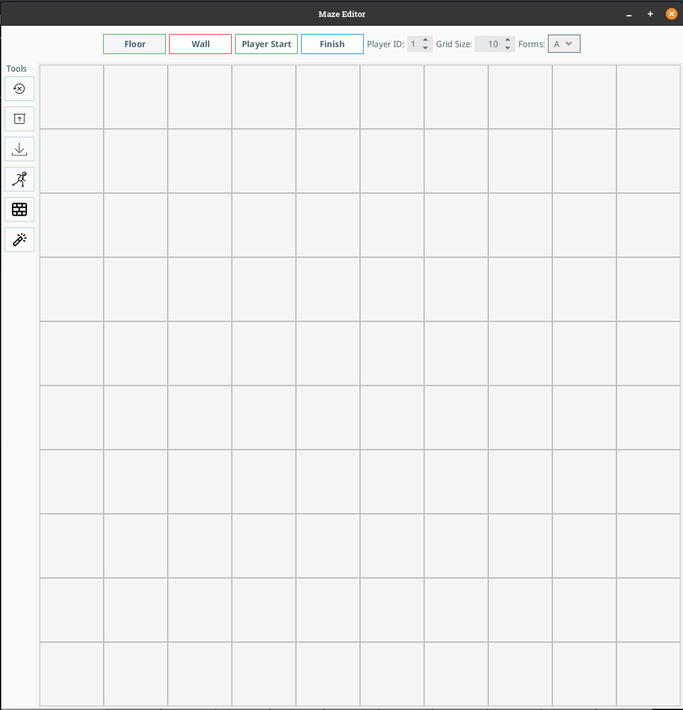
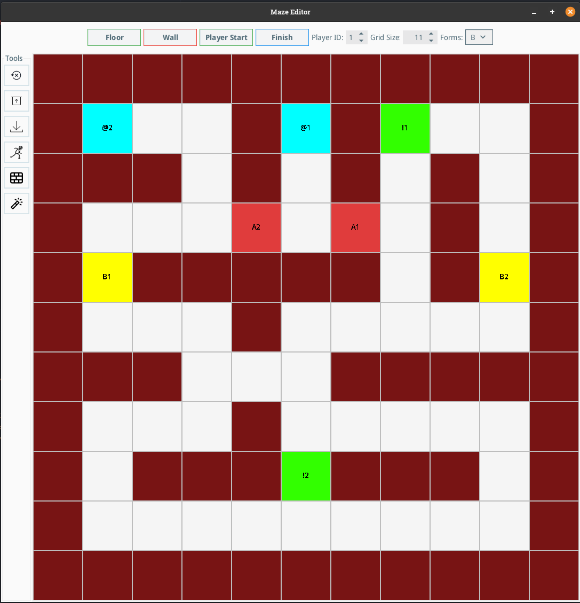

# Maze Creator

This project is a maze creator application built in Java. It allows users to create, mazes with forms collection mechanics for the Maze Runner game system.



## Generated Map Example



```json
{
  "name": "Laby",
  "forms": [
    {
      "id": "A",
      "name": "Form A"
    },
    {
      "id": "B",
      "name": "Form B"
    }
  ],
  "maze": "######################/##@2    ##@1##!1    ##/######  ##  ##  ##  ##/##      A2  A1  ##  ##/##B1##########  ##B2##/##      ##          ##/######      ##########/##      ##          ##/##  ######!2######  ##/##                  ##/######################"
}
```

## Explanation

- pid := Player ID
- The "@(pid)" indicates Spawns/Starts, the "!(pid)" indicates Finishes for the finish for each player.
- The forms are collectables that the user has to collect in an order, for example we can have A(pid) 
   that needs to be collected first after that if it exists we need to collect B(pid) ...
- There were also Sheets, but I did not figure out at this point what they do.

## Features

### Form Collection System  
- **Forms A-Z**: Complete alphabet of collectible forms
- **Sequential Collection**: Players must collect forms in alphabetical order
- **Player Ownership**: Each form belongs to a specific player (1-4)

### Important
- **Export**: JSON format compatible with Maze Runner game engine
- **Zoom Function**: You can zoom either with CTRL + Mousewheel or with CTRL +/-

## Project Structure

The project is organized as follows:

*   **`src/main/java/net/simplehardware/`**: Contains the source code for the application.
*   **`Examples/`**: Contains example maze configurations.
    *   **`WAM.json`**: Original example maze definition in JSON format.
## How to run

### From IDE
Import the project into your Java IDE and run `MazeEditor.main()`.

### From Command Line
```bash
maven install
```

### Pre-built Release
Download the Release version and run with:
```bash
java -jar MazeCreator_1_3.jar
```

## Usage

1. **Basic Editing**: Use Floor/Wall buttons for basic maze structure
2. **Player Setup**: Set Player ID and place Start (@) and Finish (!) positions
3. **Forms Placement**: Use A-Z form buttons to place collectible forms
6. **Export**: Save as JSON for use with Maze Runner game engine

## Maze Format

The enhanced maze format supports:
- **Cell Types**: Floor, Wall, Start (@), Finish (!), Forms (A-Z), Sheets (S)
- **Player Encoding**: Each element includes player ownership (1-8)
- **Sequential Forms**: Players must collect A, B, C... in exact order
- **JSON Structure**: Compatible with Maze Runner game engine

## Key Components

### Core Classes
*   **`MazeEditor.java`**: Main application window with enhanced UI and mode management
*   **`MazeGrid.java`**: Interactive maze grid with zoom and editing capabilities  
*   **`CellButton.java`**: Individual maze cell with form rendering and player colors
*   **`Mode.java`**: Enhanced enum supporting Floor, Wall, Start, Finish, Forms A-Z, and Sheet
*   **`MazeIO.java`**: Advanced JSON import/export with form encoding support
*   **`ToolbarFactory.java`**: UI factory creating main toolbar and organized forms panel

### Some Features
*   **`MazeValidator.java`**: Comprehensive maze validation with form sequence checking
*   **`MazeTemplates.java`**: Template system with pre-built balanced maze layouts
*   **`MazeInfoData.java`**: Enhanced data structure supporting form definitions
*   **`FormInfo.java`**: Form metadata class for JSON serialization

### Legacy Components  
*   **`LabyrinthGenerator.java`**: Original maze structure generator (experimental)

## Requirements

- Java 21+
- Gson library (used: gson-2.13.2.jar)
- Swing UI framework
